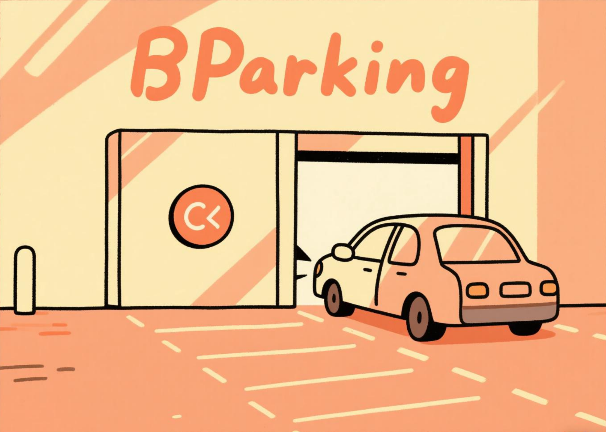

# BParking停车场管理系统

## 项目概述

> 为了完成“数据结构课程设计”

本项目是一个基于C语言的停车场管理系统，用于模拟一个只有一个出入口的狭长停车场的运作流程。系统实现了车辆进入、离开、费用计算等功能，并使用栈和队列数据结构来模拟停车场和便道的运作机制。



## 数据结构设计

系统使用了以下数据结构：

1. **停车场栈（顺序栈）**：
   - 用于存储停车场内的车辆
   - 先进后出（LIFO）的特性符合停车场的运作方式

2. **临时栈**：
   - 用于临时存储为离开车辆让路的车辆
   - 同样采用顺序栈实现

3. **便道队列（链式队列）**：
   - 用于存储等候进入停车场的车辆
   - 先进先出（FIFO）的特性符合便道等候的运作方式

## 文件结构

项目包含以下文件：

- `parking.h`：头文件，包含数据结构定义和函数声明
- `parking.c`：实现文件，包含所有函数的实现
- `main.c`：主程序，包含用户交互界面
- `Makefile`：用于编译项目的配置文件
- `compile.bat`：Windows批处理文件，用于编译项目
- `README.md`：项目说明文档（当前文件）

## 核心数据结构详解

### 车辆信息结构体

```c
typedef struct {
    int carNumber;      // 车牌号
    time_t arriveTime;  // 到达时间
    time_t leaveTime;   // 离开时间
} Car;
```

### 停车场栈结构

```c
typedef struct {
    Car data[STACKSIZE];
    int top;
} ParkingStack;
```

### 便道队列节点

```c
typedef struct QueueNode {
    Car car;
    struct QueueNode *next;
} QueueNode;
```

### 便道队列

```c
typedef struct {
    QueueNode *front;
    QueueNode *rear;
} WaitingQueue;
```

## 核心功能详解

### 1. 车辆进入停车场

函数 `parkCar` 实现了车辆进入停车场的逻辑：
- 首先检查车牌号是否已存在于停车场或便道中
- 如果停车场有空位，车辆直接进入停车场
- 如果停车场已满，车辆进入便道等候

```c
void parkCar(ParkingStack *parkingLot, WaitingQueue *waitingLane, int carNumber) {
    // 检查车牌号是否已存在
    int existsStatus = isCarNumberExists(parkingLot, waitingLane, carNumber);
    if (existsStatus != 0) {
        if (existsStatus == 1) {
            printf("车牌号为 %d 的车辆已在停车场内，不能重复进入！\n", carNumber);
        } else {
            printf("车牌号为 %d 的车辆已在便道上等候，不能重复进入！\n", carNumber);
        }
        return;
    }
    
    Car newCar = {carNumber, time(NULL), 0};
    
    if (!isStackFull(parkingLot)) {
        // 停车场有空位，直接进入
        if (push(parkingLot, newCar)) {
            printf("车牌号为 %d 的车辆已进入停车场\n", carNumber);
        }
    } else {
        // 停车场已满，进入便道等候
        enqueue(waitingLane, newCar);
        printf("停车场已满，车牌号为 %d 的车辆在便道等候\n", carNumber);
    }
}
```

### 2. 车辆离开停车场

函数 `leaveCar` 实现了车辆离开停车场的逻辑：
- 首先检查车辆是否在停车场内
- 计算需要移动的车辆数量
- 将车辆上方的车辆移到临时栈
- 车辆离开后，计算停车费用
- 将临时栈中的车辆移回停车场
- 如果便道上有等候的车辆，让其进入停车场

```c
void leaveCar(ParkingStack *parkingLot, ParkingStack *tempLot, WaitingQueue *waitingLane, int carNumber) {
    if (isStackEmpty(parkingLot)) {
        printf("停车场内没有车辆！\n");
        return;
    }
    
    // 首先检查车辆是否在停车场内
    int position = findCarPosition(parkingLot, carNumber);
    
    if (position == -1) {
        printf("停车场内没有车牌号为 %d 的车辆！\n", carNumber);
        return;
    }
    
    // 计算需要移动的车辆数量
    int carsToMove = parkingLot->top - position;
    printf("要让出 %d 辆车为车牌号 %d 的车辆让路\n", carsToMove, carNumber);
    
    // 将车辆上方的车辆移到临时栈
    for (int i = 0; i < carsToMove; i++) {
        Car car = pop(parkingLot);
        push(tempLot, car);
        printf("车牌号 %d 的车辆暂时移出停车场\n", car.carNumber);
    }
    
    // 移除要离开的车辆
    Car leavingCar = pop(parkingLot);
    leavingCar.leaveTime = time(NULL);
    calculateFee(leavingCar);
    printf("车牌号为 %d 的车辆已离开停车场\n", leavingCar.carNumber);
    
    // 将临时栈中的车辆移回停车场
    while (!isStackEmpty(tempLot)) {
        Car car = pop(tempLot);
        push(parkingLot, car);
        printf("车牌号 %d 的车辆返回停车场\n", car.carNumber);
    }
    
    // 如果便道上有等候的车辆，让其进入停车场
    if (!isQueueEmpty(waitingLane) && !isStackFull(parkingLot)) {
        Car waitingCar = dequeue(waitingLane);
        waitingCar.arriveTime = time(NULL); // 更新进入停车场的时间
        push(parkingLot, waitingCar);
        printf("车牌号为 %d 的车辆从便道进入停车场\n", waitingCar.carNumber);
    }
}
```

### 3. 停车费用计算

函数 `calculateFee` 实现了停车费用的计算：
- 计算停车时间（秒）
- 将时间转换为小时、分钟和秒
- 计算费用（每小时10元，不足一小时按一小时计算）
- 显示详细的费用计算结果

```c
void calculateFee(Car car) {
    if (car.leaveTime == 0 || car.arriveTime == 0) {
        return;
    }
    
    // 计算停车时间（秒）
    double parkingTime = difftime(car.leaveTime, car.arriveTime);
    
    // 将到达时间和离开时间转换为可读格式
    char arriveTimeStr[30];
    char leaveTimeStr[30];
    struct tm *arriveInfo = localtime(&car.arriveTime);
    struct tm *leaveInfo = localtime(&car.leaveTime);
    
    strftime(arriveTimeStr, sizeof(arriveTimeStr), "%Y-%m-%d %H:%M:%S", arriveInfo);
    strftime(leaveTimeStr, sizeof(leaveTimeStr), "%Y-%m-%d %H:%M:%S", leaveInfo);
    
    // 计算小时、分钟和秒
    int hours = (int)(parkingTime / 3600);
    int minutes = (int)((parkingTime - hours * 3600) / 60);
    int seconds = (int)(parkingTime - hours * 3600 - minutes * 60);
    
    // 计算费用（假设每小时收费10元，不足一小时按一小时计算）
    double fee;
    if (hours == 0 && (minutes > 0 || seconds > 0)) {
        // 不足一小时按一小时收费
        fee = 10.0;
    } else {
        fee = hours * 10.0;
        // 如果有分钟或秒，则多收取一小时费用
        if (minutes > 0 || seconds > 0) {
            fee += 10.0;
        }
    }
    
    printf("\n===== 停车费用计算 =====\n");
    printf("车牌号: %d\n", car.carNumber);
    printf("进入时间: %s\n", arriveTimeStr);
    printf("离开时间: %s\n", leaveTimeStr);
    printf("停车时间: %d小时 %d分钟 %d秒\n", hours, minutes, seconds);
    printf("停车费用: %.2f 元\n", fee);
    printf("==========================\n");
}
```

## 辅助功能详解

### 1. 车牌号查找

函数 `findCarPosition` 用于查找车辆在停车场中的位置：

```c
int findCarPosition(ParkingStack *parkingLot, int carNumber) {
    if (isStackEmpty(parkingLot)) {
        return -1;
    }
    
    for (int i = 0; i <= parkingLot->top; i++) {
        if (parkingLot->data[i].carNumber == carNumber) {
            return i;
        }
    }
    
    return -1;
}
```

### 2. 车牌号重复检查

函数 `isCarNumberExists` 用于检查车牌号是否已存在于停车场或便道中：

```c
int isCarNumberExists(ParkingStack *parkingLot, WaitingQueue *waitingLane, int carNumber) {
    // 检查停车场
    for (int i = 0; i <= parkingLot->top; i++) {
        if (parkingLot->data[i].carNumber == carNumber) {
            return 1; // 车牌号已存在于停车场
        }
    }
    
    // 检查便道
    QueueNode *current = waitingLane->front;
    while (current != NULL) {
        if (current->car.carNumber == carNumber) {
            return 2; // 车牌号已存在于便道
        }
        current = current->next;
    }
    
    return 0; // 车牌号不存在
}
```

### 3. 队列内存清理

函数 `clearQueue` 用于清空队列并释放所有内存：

```c
void clearQueue(WaitingQueue *queue) {
    while (!isQueueEmpty(queue)) {
        dequeue(queue);
    }
}
```

## 用户界面

系统提供了简单的文本界面，用户可以通过输入命令和车牌号来操作系统：

1. 车辆进入：输入 `1 车牌号`
2. 车辆离开：输入 `2 车牌号`
3. 显示停车场状态：输入 `3`
4. 退出系统：输入 `0`

```c
void printMenu() {
    printf("\n===== 停车场管理系统 =====\n");
    printf("1. 车辆进入 (输入: 1 车牌号)\n");
    printf("2. 车辆离开 (输入: 2 车牌号)\n");
    printf("3. 显示停车场状态\n");
    printf("0. 退出系统\n");
    printf("请输入操作命令: ");
}
```

## 编译和运行

### 在Windows系统上

1. 双击 `compile.bat` 文件，它会尝试使用不同的编译器来编译项目
2. 如果编译成功，系统会自动运行

### 在其他系统上

使用GCC编译器：

```bash
gcc -Wall -o parking_system main.c parking.c
./parking_system
```

## 系统优化

本系统进行了多项优化，包括：

1. **内存管理优化**：
   - 添加了专门的内存清理函数
   - 优化了内存分配和释放的逻辑

2. **车辆查找逻辑优化**：
   - 添加了专门的车辆查找函数
   - 优化了车辆移动的逻辑，减少不必要的操作

3. **车牌号重复检查**：
   - 防止同一车牌号多次进入系统
   - 提高了系统的健壮性

4. **停车费用计算优化**：
   - 更详细的时间和费用计算
   - 更友好的费用显示

5. **输出信息优化**：
   - 更详细的操作提示
   - 更清晰的错误信息

## 扩展功能建议

系统可以进一步扩展以下功能：

1. **数据持久化**：将停车记录保存到文件中
2. **图形用户界面**：使用图形库实现更友好的界面
3. **更多车辆信息**：添加车型、颜色等信息
4. **复杂计费规则**：实现不同时段不同费率的计费规则
5. **多停车场管理**：扩展为管理多个停车场的系统

## 总结

本停车场管理系统通过栈和队列数据结构，成功模拟了一个特殊停车场的运作流程。系统实现了车辆进入、离开、费用计算等核心功能，并进行了多项优化，使其更加健壮和用户友好。
