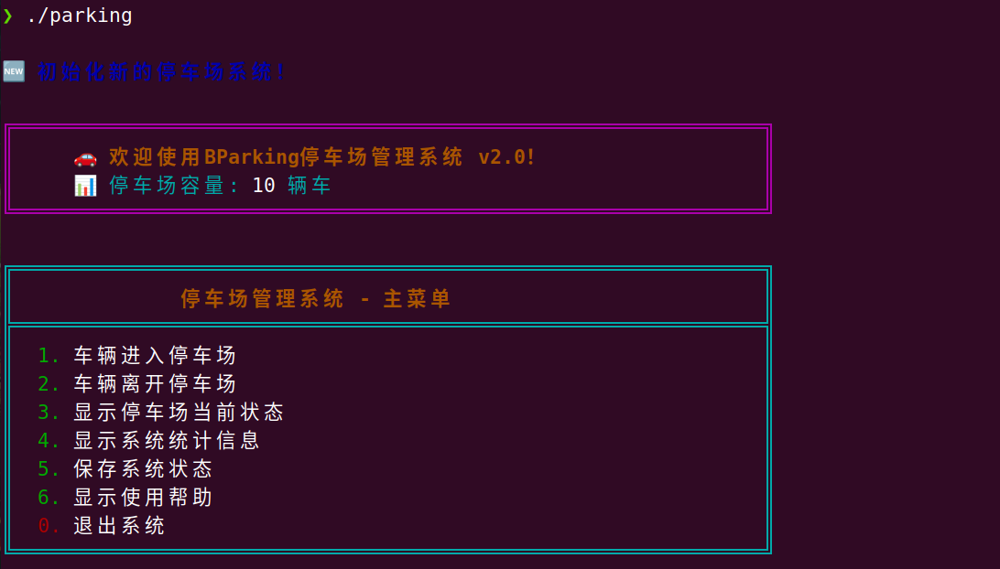
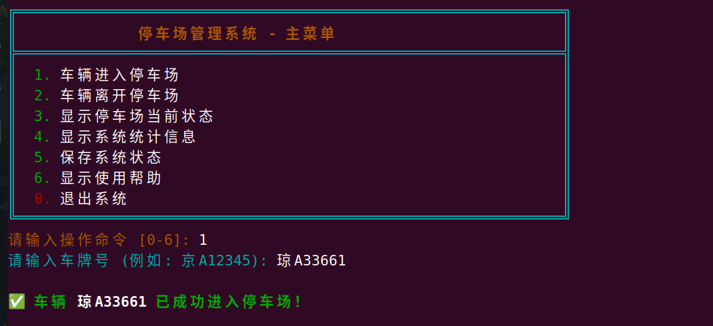
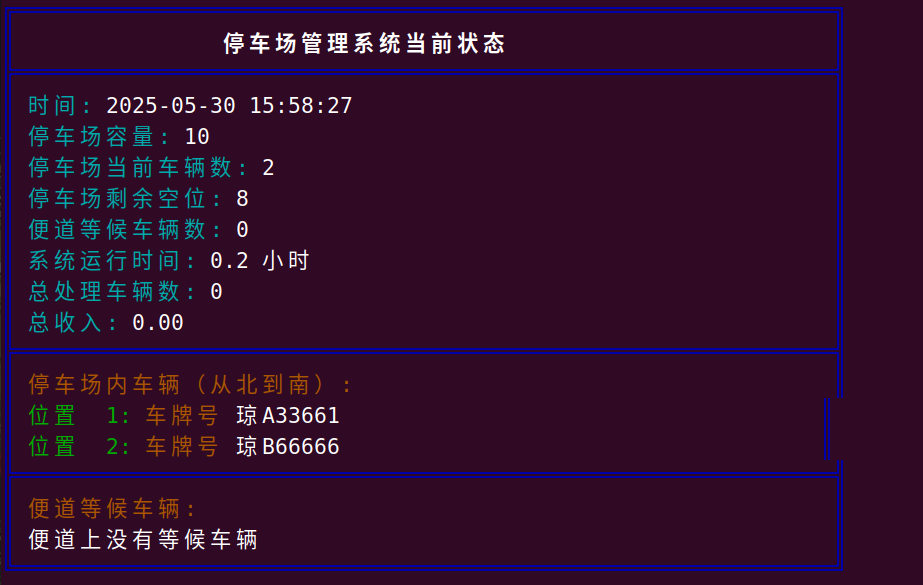
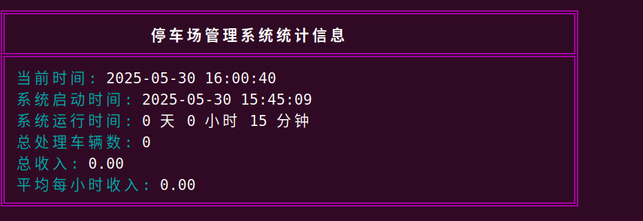
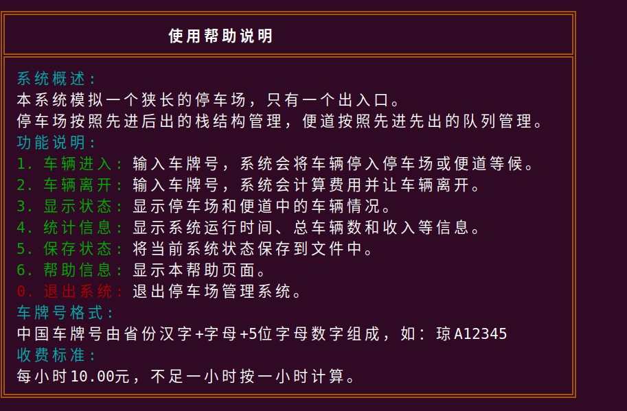

<div align="center">

# 🚗 BParking停车场管理系统

[](https://opensource.org/licenses/MIT)
[](https://en.wikipedia.org/wiki/C_(programming_language))
[](https://www.microsoft.com/windows)
[]()

*基于数据结构课程设计的停车场管理系统*


</div>

## 📝 项目概述

BParking是一个基于C语言开发的停车场管理系统，模拟了一个只有一个出入口的狭长停车场的运作流程。系统实现了车辆进出管理、费用计算、状态显示等功能，并采用了栈和队列数据结构来模拟停车场和便道的运作机制。

## 项目展示
> 主要基于Linux终端演示（这里采用Ubuntu）

### 系统架构图

```bash
┌─────────────────────────────┐
│       用户交互界面           │
└───────────────┬─────────────┘
                ▼
┌─────────────────────────────┐
│       停车场管理系统         │
├─────────────────────────────┤
│  ┌───────────┐ ┌───────────┐│
│  │ 停车场栈   │ │ 便道队列  │ │
│  └───────────┘ └───────────┘│
└─────────────────────────────┘
```

### 📂 文件结构

```bash
BParking/
├── main.c         # 主程序，包含用户交互界面
├── parking.c      # 主要函数实现
├── parking.h      # 头文件，这个主要包含数据结构定义和函数声明
├── color.h        # 颜色输出

```

### 主菜单



### 车辆进入



### 显示停车场当前状态
主要显示停车场和便道的车辆信息，和具体位置，以及停车费用


### 系统信息
主要显示系统运行时间，总处理车辆数，总收入等信息


### 使用帮助



### ✨ 主要特性

- 🚘 **车辆进出管理**：记录车辆进入和离开停车场的时间和位置
- 💰 **费用计算**：根据停车时长自动计算停车费用
- 📊 **状态显示**：实时显示停车场和便道的车辆状态
- 💾 **自动保存**：车辆进出时自动保存系统状态，确保数据安全
- 🖥️ **彩色界面**：提供美观直观的彩色命令行界面
- 📖 **帮助说明**：内置详细的使用帮助文档
- 🇨🇳 **中文车牌支持**：完全支持中国标准车牌格式

## 🔧 技术架构

### 数据结构设计

系统使用了以下数据结构：

- **停车场栈（顺序栈）**：用于存储停车场内的车辆，先进后出（LIFO）特性符合停车场的运作方式
- **临时栈**：用于临时存储为离开车辆让路的车辆
- **便道队列（链式队列）**：用于存储等候进入停车场的车辆，先进先出（FIFO）特性符合便道等候的运作方式


## 💻 核心数据结构

### 车辆信息结构体

```c
typedef struct {
    char plateNumber[MAX_PLATE_LEN]; // 车牌号（支持中文字符）
    time_t arriveTime;               // 到达时间
    time_t leaveTime;                // 离开时间
} Car;
```

### 停车场栈结构

```c
typedef struct {
    Car data[STACKSIZE];
    int top;
} ParkingStack;
```

### 便道队列

```c
typedef struct {
    QueueNode *front;
    QueueNode *rear;
    int count;         // 队列中的车辆数量
} WaitingQueue;
```

## 🚀 核心功能

### 1. 车辆进入停车场

```c
int parkCar(ParkingStack *parkingLot, WaitingQueue *waitingLane, const char *plateNumber) {
    // 检查车牌号是否已存在
    if (isCarExists(parkingLot, waitingLane, plateNumber)) {
        return ERR_EXISTS; // 车牌号已存在
    }
    
    // 创建新车辆
    Car newCar = createCar(plateNumber);
    
    if (!isStackFull(parkingLot)) {
        // 停车场有空位，直接进入
        int result = push(parkingLot, newCar);
        if (result == SUCCESS) {
            // 自动保存系统状态，确保数据安全
            SystemStats stats = {0};
            saveSystemState(parkingLot, waitingLane, &stats);
        }
        return result;
    } else {
        // 停车场已满，进入便道等候
        int result = enqueue(waitingLane, newCar);
        if (result == SUCCESS) {
            // 自动保存系统状态，确保数据安全
            SystemStats stats = {0};
            saveSystemState(parkingLot, waitingLane, &stats);
        }
        return result;
    }
}
```

### 2. 车辆离开停车场

```c
int leaveCar(ParkingStack *parkingLot, ParkingStack *tempLot, WaitingQueue *waitingLane, const char *plateNumber, SystemStats *stats) {
    if (isStackEmpty(parkingLot)) {
        return ERR_EMPTY; // 停车场为空
    }
    
    // 首先检查车辆是否在停车场内
    // 使用优化的搜索算法，从栈顶开始搜索
    int position = findCarPosition(parkingLot, plateNumber);
    
    if (position == -1) {
        return ERR_NOT_FOUND; // 未找到车辆
    }
    
    // 计算需要移动的车辆数量
    int carsToMove = parkingLot->top - position;
    
    // 将车辆上方的车辆移到临时栈
    for (int i = 0; i < carsToMove; i++) {
        Car car = pop(parkingLot);
        push(tempLot, car);
    }
    
    // 移除要离开的车辆
    Car leavingCar = pop(parkingLot);
    leavingCar.leaveTime = time(NULL);
    
    // 计算费用并更新统计信息
    double fee = calculateFee(leavingCar);
    if (stats != NULL) {
        stats->totalCars++;
        stats->totalRevenue += fee;
    }
    
    // 将临时栈中的车辆移回停车场
    while (!isStackEmpty(tempLot)) {
        Car car = pop(tempLot);
        push(parkingLot, car);
    }
    
    // 如果便道上有等候的车辆，让其进入停车场
    if (!isQueueEmpty(waitingLane) && !isStackFull(parkingLot)) {
        Car waitingCar = dequeue(waitingLane);
        waitingCar.arriveTime = time(NULL); // 更新进入停车场的时间
        push(parkingLot, waitingCar);
    }
    
    // 自动保存系统状态
    saveSystemState(parkingLot, waitingLane, stats);
    
    return SUCCESS;
    
    printf("\n===== 停车费用计算 =====\n");
    printf("车牌号: %d\n", car.carNumber);
    printf("进入时间: %s\n", arriveTimeStr);
    printf("离开时间: %s\n", leaveTimeStr);
    printf("停车时间: %d小时 %d分钟 %d秒\n", hours, minutes, seconds);
    printf("停车费用: %.2f 元\n", fee);
    printf("==========================\n");
}
```

## 辅助功能详解

### 1. 车牌号查找

函数 `findCarPosition` 用于查找车辆在停车场中的位置：

### 2. 中文车牌号验证

```c
bool isValidPlateNumber(const char *plateNumber) {
    // 检查长度
    size_t len = strlen(plateNumber);
    if (len < 7 || len > MAX_PLATE_LEN - 1) {
        return false;
    }
    
    // 中国车牌号格式验证
    // 标准格式：一个汉字省份简称（如京、沪、粤等）+ 一个字母 + 5个字符（字母或数字）
    
    // 检查第一个字符是否为中文省份简称
    // 使用UTF-8编码检查首个字符是否为中文字符
    unsigned char firstByte = (unsigned char)plateNumber[0];
    if ((firstByte & 0x80) == 0) { // 不是多字节字符
        return false;
    }
    
    // 检查第二个字符开始是否为大写英文字母
    // 首先跳过第一个中文字符（UTF-8中文字符通常是3个字节）
    int offset = 0;
    if ((firstByte & 0xE0) == 0xC0) { // 2字节字符
        offset = 2;
    } else if ((firstByte & 0xF0) == 0xE0) { // 3字节字符（大多数中文）
        offset = 3;
    } else if ((firstByte & 0xF8) == 0xF0) { // 4字节字符
        offset = 4;
    } else {
        return false; // 无效的UTF-8字符
    }
    
    // 检查第二个字符（省份简称后的字符）是否为大写英文字母 A-Z
    if (offset >= len || plateNumber[offset] < 'A' || plateNumber[offset] > 'Z') {
        return false;
    }
    
    // 检查剩余字符是否为字母或数字
    for (size_t i = offset + 1; i < len; i++) {
        char c = plateNumber[i];
        if (!((c >= '0' && c <= '9') || (c >= 'A' && c <= 'Z'))) {
            return false;
        }
    }
    
    // 检查总长度是否符合要求（省份简称 + 字母 + 5个字符）
    int remainingChars = len - offset - 1; // 减去省份简称和地区字母
    if (remainingChars < 5) {
        return false;
    }
    
    return true;
}
```

### 3. 车牌号比较优化

```c
bool comparePlateNumbers(const char *plate1, const char *plate2) {
    // 首先检查指针是否为空
    if (plate1 == NULL || plate2 == NULL) {
        return false;
    }
    
    // 快速检查长度是否一致（可以提前判断不相等的情况）
    size_t len1 = strlen(plate1);
    size_t len2 = strlen(plate2);
    if (len1 != len2) {
        return false;
    }
    
    // 使用二进制比较确保中文字符完全匹配
    // 这比使用strcmp更安全，因为它会比较每个字节
    return memcmp(plate1, plate2, len1) == 0;
}
```

### 4. 车辆搜索算法优化

```c
int findCarPosition(ParkingStack *parkingLot, const char *plateNumber) {
    if (isStackEmpty(parkingLot)) {
        return -1;
    }
    
    // 优化：从栈顶开始搜索，因为最近停车的车辆更可能离开
    // 这种方式可以减少平均搜索时间
    for (int i = parkingLot->top; i >= 0; i--) {
        if (comparePlateNumbers(parkingLot->data[i].plateNumber, plateNumber)) {
            return i;
        }
    }
    
    return -1; // 未找到
}
```

### 5. 停车费用计算优化

```c
double calculateFee(Car car) {
    if (car.leaveTime == 0 || car.arriveTime == 0) {
        return 0.0;
    }
    
    // 计算停车时间（秒）
    double parkingTime = difftime(car.leaveTime, car.arriveTime);
    
    // 使用静态缓冲区存储时间字符串，减少内存分配
    static char arriveTimeStr[30];
    static char leaveTimeStr[30];
    
    // 使用Windows兼容的时间转换函数
    struct tm *arriveInfo = localtime(&car.arriveTime);
    struct tm *leaveInfo = localtime(&car.leaveTime);
    
    strftime(arriveTimeStr, sizeof(arriveTimeStr), "%Y-%m-%d %H:%M:%S", arriveInfo);
    strftime(leaveTimeStr, sizeof(leaveTimeStr), "%Y-%m-%d %H:%M:%S", leaveInfo);
    
    // 优化：使用更高效的时间计算方式
    int totalSeconds = (int)parkingTime;
    int hours = totalSeconds / 3600;
    int minutes = (totalSeconds % 3600) / 60;
    int seconds = totalSeconds % 60;
    
    // 优化计费算法：将小时数向上取整，更符合停车场收费惯例
    double fee;
    if (minutes > 0 || seconds > 0) {
        fee = (hours + 1) * HOURLY_RATE; // 不足一小时的部分按一小时收费
    } else {
        fee = hours * HOURLY_RATE;
    }
    
    // 彩色输出停车费用信息
    printf("\n%s%s╔═══════════════════════════════════════════════════════════════╗%s\n", STYLE_BOLD, COLOR_GREEN, COLOR_RESET);
    // ... 省略其他格式化输出代码 ...
    
    return fee;
}
```

### 3. 队列内存清理

函数 `clearQueue` 用于清空队列并释放所有内存：

```c
void clearQueue(WaitingQueue *queue) {
    while (!isQueueEmpty(queue)) {
        dequeue(queue);
    }
}
```

## 系统优化

本系统进行了多项优化，包括：

1. **内存管理优化**：
   - 采用直接遍历释放内存的方式，减少函数调用开销
   - 使用静态缓冲区存储临时字符串，减少内存分配
   - 添加空指针检查，提高系统稳定性

2. **搜索算法优化**：
   - 从栈顶开始搜索车辆，减少平均搜索时间
   - 使用二进制比较确保中文字符完全匹配
   - 快速检查长度不一致的情况，提前跳过不匹配项

3. **车牌号验证优化**：
   - 完全支持中国标准车牌格式（省份汉字+字母+5位字符）
   - 使用UTF-8编码检查汉字字符，提高兼容性
   - 增加了更严格的格式验证

4. **计费算法优化**：
   - 使用更高效的时间计算方式
   - 将小时数向上取整，更符合停车场收费惯例
   - 彩色输出停车费用信息，提高可读性

5. **自动保存功能**：
   - 车辆进入和离开时自动保存系统状态
   - 确保意外关闭程序时不会丢失数据

6. **界面美化**：
   - 使用ANSI颜色代码增强界面视觉效果
   - 添加了框线和特殊符号，提高界面美观度
   - 使用不同颜色区分不同类型的信息

7. **使用说明改进**：
   - 添加了详细的帮助页面
   - 提供了更清晰的操作指引
   - 增强了错误提示的可读性